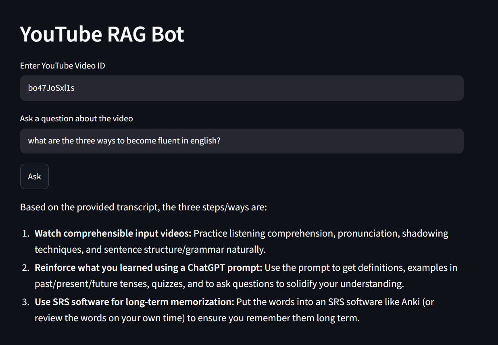

# YouTube RAG Bot

## Introduction

YouTube RAG Bot is an AI-powered application that allows users to ask questions about YouTube videos and get relevant answers, summaries, and key themes from the video.

## How It Works

The application follows these steps:

1. Video transcript is fetched from YouTube.
2. The transcript is split into smaller chunks.
3. The chunks are converted into embeddings.
4. Embeddings are stored in FAISS.
5. Relevant chunks are retrieved using similarity search.
6. The retrieved context is passed to Gemini.
7. Gemini generates the answer.

## Demo

## Usage

1. Enter a **YouTube Video ID** (not the full URL) 
2. Type your **question** in the second input box.
3. Click **Ask**.

> ⚠️ Note: The bot answers *only* using that specific video.
